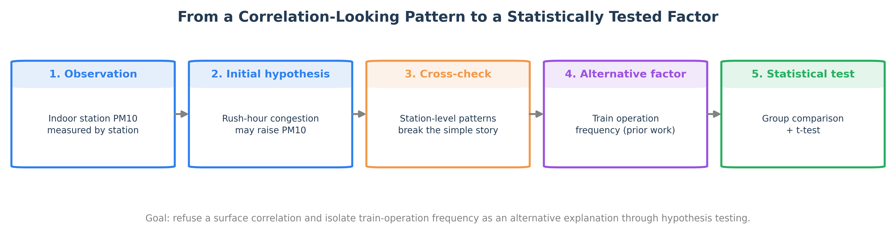
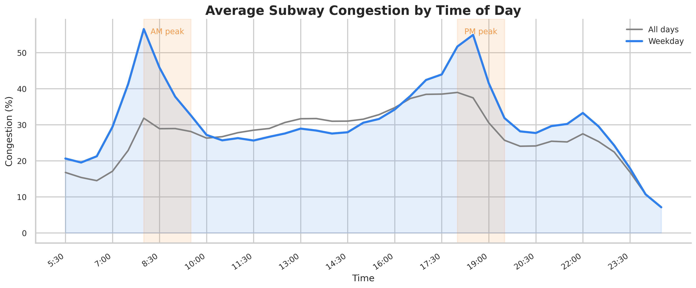
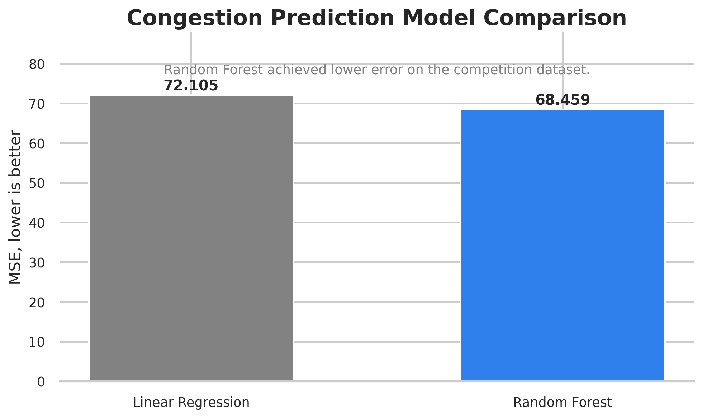
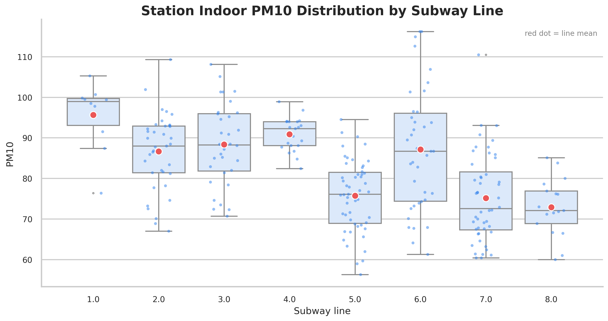
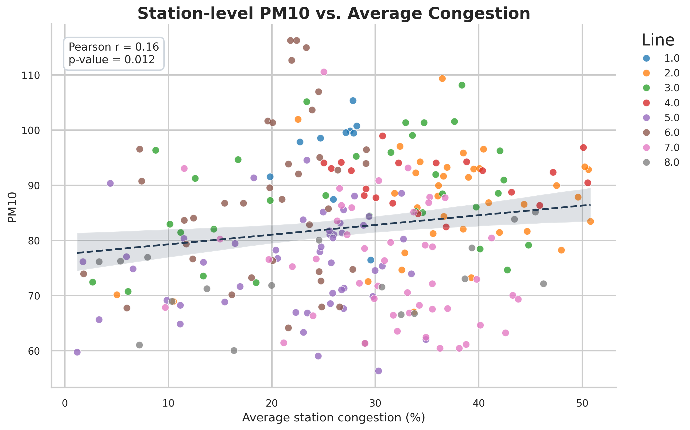
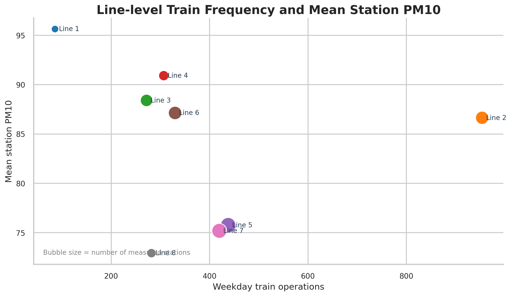
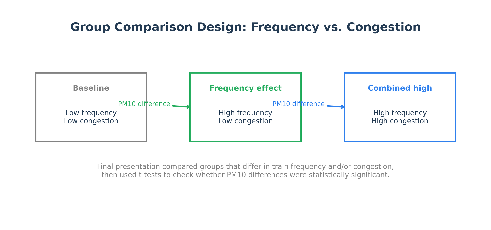
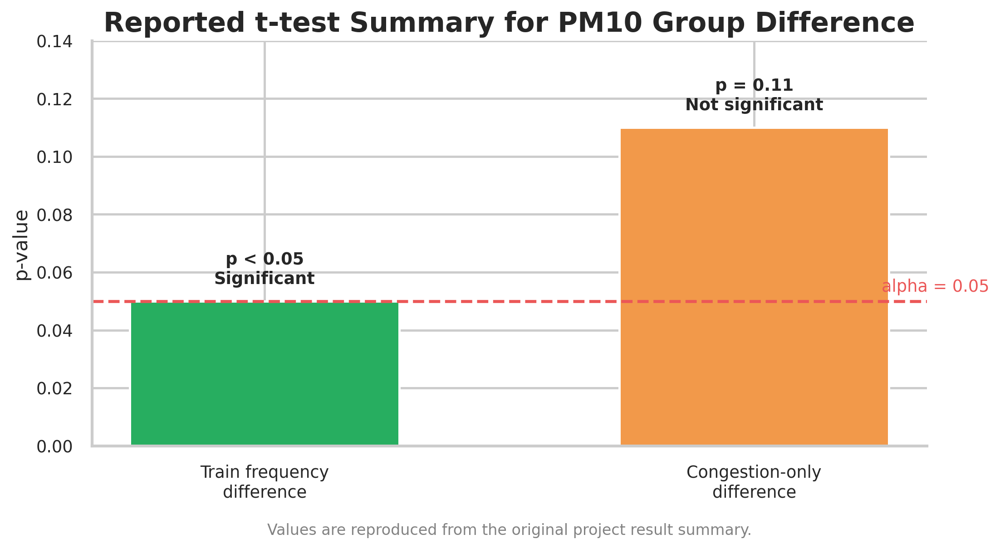

# 지하철 혼잡도 및 미세먼지 관계 분석

> 전북대학교 통계학과 빅데이터 분석 경진대회 2022 Winter — **최우수상**  
> 팀 `신통방통`: 고경수 · 문우혁 · 조성현

[Competition](https://www.kaggle.com/c/statjbnu1) · Python/Jupyter · EDA · Machine Learning · Statistical Hypothesis Testing

---

## 발표자료 기반 분석 흐름

최종 발표자료(`최종본.pdf`)는 두 개의 연구 과제로 구성되어 있습니다.

1. **혼잡도를 예측하는 모델 구현**
   - 혼잡도의 개념
   - 혼잡도 시각화
   - 변수 선택 및 추가 변수 고려
   - 선형회귀 / 랜덤포레스트 모델링

2. **혼잡도와 미세먼지 사이의 관계 분석**
   - 대기질 데이터 교체 및 추가
   - 내부/외부 미세먼지 비교
   - “정말 혼잡도가 원인인가?”라는 원인 분석
   - 운행 빈도와 혼잡도 조건을 분리한 유의성 검정



---

## Dataset

| File | Description |
|---|---|
| `data/raw/statjbnu1/data1.csv` | 서울교통공사 지하철 혼잡도 정보. 조사일자, 호선, 역번호, 역명, 상·하선 구분, 30분 단위 혼잡도 포함 |
| `data/raw/statjbnu1/data2.csv` | 서울 지하철 역사 대기 정보. PM10, CO2, HCHO, CO 포함 |
| `data/raw/statjbnu1/data3.csv` | 자치구별 지하철역 정보 |
| `new_data4.csv` | 노선별 운행 횟수 및 수송 인원 요약 보조 자료 |

자료 출처:

- <https://www.data.go.kr/data/15071311/fileData.do>
- <https://data.seoul.go.kr/dataList/OA-2732/F/1/datasetView.do>
- <https://www.gimi9.com/dataset/www-data-go-kr-data-filedata-15081868>

---

# 연구 과제 1. 혼잡도를 예측하는 모델 구현

## 1.1 혼잡도의 개념

혼잡도는 일정 시간 동안 지하철 차량을 이용하는 승객 밀집 정도를 나타내는 지표입니다. 본 프로젝트에서는 서울교통공사 혼잡도 데이터의 30분 단위 값을 사용해 역별·시간대별 혼잡 패턴을 살펴보고, 하루 평균 혼잡도를 예측 대상으로 설정했습니다.

참고 문헌:

- *빅데이터 분석을 이용한 지하철 혼잡도 예측 및 추천시스템*

## 1.2 혼잡도 시각화

먼저 시간대별 평균 혼잡도를 확인해 출퇴근 시간대 peak가 존재하는지 살펴봤습니다.



이 시각화는 발표자료의 “혼잡도 시각화” 파트를 재구성한 것으로, 평일 평균 혼잡도가 오전/오후 통근 시간대에 높아지는 구조를 보여줍니다.

## 1.3 변수 선택 및 추가 변수 고려

기본 변수는 다음과 같습니다.

- 조사일자
- 호선
- 역 번호
- 역명
- 상·하선/내·외선 구분
- 시간대별 혼잡도

예측 대상은 **하루 평균 혼잡도**로 설정했습니다.

추가 변수로는 역 주변 교통 시설, 특히 **버스터미널 여부**를 고려했습니다. 이는 승하차 인원과 주변 교통 시설의 연관성을 다룬 선행연구를 참고한 것입니다.

참고 문헌:

- *기계학습을 이용한 서울 지하철 승하차 인원 예측*

## 1.4 Modeling

| 항목 | 내용 |
|---|---|
| 독립변수 X | 조사일자, 구분, 호선, 버스터미널 여부 |
| 종속변수 Y | 하루 평균 혼잡도 |
| 비교 모델 | 선형회귀 모형, 랜덤포레스트 모형 |
| 평가 지표 | MSE |

| Model | MSE | Note |
|---|---:|---|
| Linear Regression | 72.105 | 기준 모델 |
| Random Forest | 68.459 | 더 낮은 MSE로 최종 채택 |



---

# 연구 과제 2. 혼잡도와 미세먼지 사이의 관계

## 2.1 데이터 교체 및 추가

두 번째 연구 과제에서는 혼잡도와 역사 내 미세먼지(PM10)의 관계를 분석했습니다. 발표자료에서는 최신 대기질 데이터를 추가로 참고해 내부/외부 미세먼지 비교를 수행했습니다.

발표자료의 추가 참고 출처:

- <https://www.inair.or.kr/info/reference.html>
- <https://www.data.go.kr/data/15089266/fileData.do>

현재 repo에서는 대회 제공 역사 대기 정보(`data2.csv`)와 노선별 운행 빈도 보조자료(`new_data4.csv`)를 사용해 재현 가능한 시각화를 제공합니다.

## 2.2 역사 내부 PM10 분포 (노선별)

발표자료의 출발점은 **지하철 역사 내부 미세먼지와 외부 미세먼지의 시간대별 패턴 비교**였습니다. 내부 미세먼지가 외부와 다른 시간대 패턴을 보여, 역사 내부 요인이 PM10 증가에 관여할 가능성을 검토했습니다. (외부 대기질 자료는 대회 외부에서 별도로 참고한 자료로, 이 repo에는 포함돼 있지 않습니다.)

따라서 이 repo에서는 공개된 `data2.csv`(역사 내부 PM10)를 기준으로 **노선별 PM10 분포**를 정리합니다. 아래 그림은 노선별 내부 PM10의 분포와 노선 평균(빨간 점)을 보여줍니다.



## 2.3 정말 혼잡도가 원인일까?

내부 PM10이 출퇴근 시간대에 높아지는 패턴은 혼잡도와 유사해 보일 수 있습니다. 따라서 초기 가설은 “승객 혼잡도가 미세먼지 증가의 원인일 수 있다”였습니다.

이를 확인하기 위해 역 단위 평균 혼잡도와 역사 PM10을 병합해 탐색했습니다.



이 비교는 PM10 차이가 단순히 평균 혼잡도 하나만으로 설명되기 어렵다는 점을 확인하기 위한 탐색적 분석입니다.

## 2.4 대안 요인: 열차 운행 빈도

발표자료는 “정말 혼잡도가 원인일까?”라는 질문에서 한 단계 더 나아가, 관련 자료와 선행연구를 참고해 **열차 운행 빈도**를 대안 설명 요인으로 검토했습니다.

참고 자료:

- DAP 카카오AI 리포트: 지하철 내 미세먼지 관련 자료
- *지하철 역사 미세먼지(PM10)의 확산방향과 확산속도 추정*

노선별 평일 운행 횟수와 노선 평균 PM10을 함께 비교하면 다음과 같습니다.



열차 운행 빈도는 노선 단위 변수이므로 역 단위 PM10에 대한 직접적인 인과관계를 의미하지는 않습니다. 다만 혼잡도 외에도 노선 운행 구조를 함께 고려해야 함을 보여주는 보조 분석으로 사용했습니다.

## 2.5 유의성 검증 설계

발표자료에서는 운행 빈도와 혼잡도를 분리해 다음과 같은 집단 비교를 수행했습니다.

- 운행 빈도 낮음 / 혼잡도 낮음
- 운행 빈도 높음 / 혼잡도 낮음
- 운행 빈도 높음 / 혼잡도 높음



이 비교 설계는 “혼잡도만 높을 때도 PM10 차이가 유의한가?”와 “운행 빈도가 다를 때 PM10 차이가 유의한가?”를 분리해 보기 위한 것입니다.

## 2.6 t-test 결과

원 프로젝트 발표자료와 README의 요약 기준 t-test 결과는 다음과 같습니다.

| 비교 조건 | t-test 결과 | 해석 |
|---|---|---|
| 운행 빈도 차이 있음, 혼잡도 차이 없음 | p-value < 0.05 | PM10 차이가 통계적으로 유의함 |
| 운행 빈도 차이 없음, 혼잡도 차이 있음 | p-value = 0.11 | 통계적으로 유의하지 않음 |
| 운행 빈도와 혼잡도 모두 차이 있음 | PM10 차이 관측 | 두 요인이 함께 다른 조건 |



따라서 발표자료의 결론은 **역사 내 PM10 차이를 설명할 때 승객 혼잡도만 보기보다 열차 운행 빈도와 운행 구조를 함께 고려해야 한다**는 방향으로 정리됩니다.

---

## Reproducibility

새 시각화는 아래 스크립트로 재생성할 수 있습니다.

```bash
python scripts/visualize_subway_pm10.py
```

생성 파일:

```text
assets/figures/
├── fig01_analysis_flow.png
├── fig02_congestion_hourly_profile.png
├── fig03_pm10_by_line_distribution.png
├── fig04_pm10_vs_congestion_scatter.png
├── fig05_line_frequency_pm10_overview.png
├── fig06_model_mse_comparison.png
├── fig07_reported_ttest_summary.png
└── fig08_group_comparison_design.png
```

> Note: `fig07_reported_ttest_summary.png`는 원 프로젝트 발표자료/README에 기록된 p-value를 요약 시각화한 것입니다. 정확한 원본 t-test 집단 정의와 추가 전처리 자료 전체를 복원한 재계산 결과는 아닙니다.

---

## Repository Structure

```text
.
├── data/raw/statjbnu1/
│   ├── data1.csv
│   ├── data2.csv
│   └── data3.csv
├── assets/figures/
│   ├── fig01_analysis_flow.png
│   ├── fig02_congestion_hourly_profile.png
│   ├── fig03_pm10_by_line_distribution.png
│   ├── fig04_pm10_vs_congestion_scatter.png
│   ├── fig05_line_frequency_pm10_overview.png
│   ├── fig06_model_mse_comparison.png
│   ├── fig07_reported_ttest_summary.png
│   └── fig08_group_comparison_design.png
├── scripts/visualize_subway_pm10.py
├── FINAL.ipynb
├── train.ipynb
├── train_ML.ipynb
├── train_ML_V2.ipynb
├── train_Vis.ipynb
├── visuality.ipynb
├── new_data4.csv
├── 최종본.pdf
└── 최종본.pptx
```
